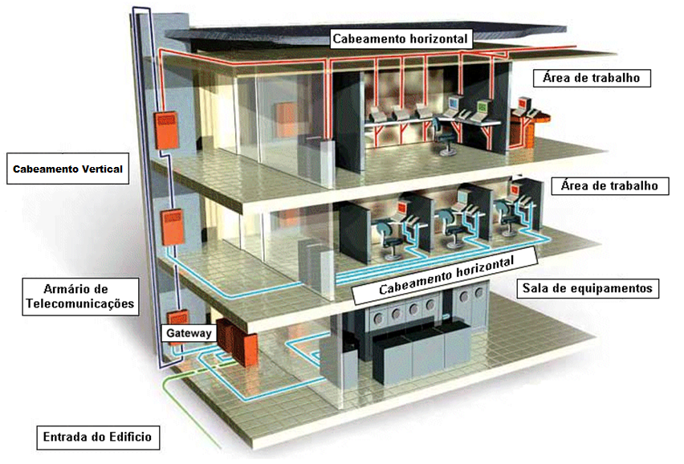
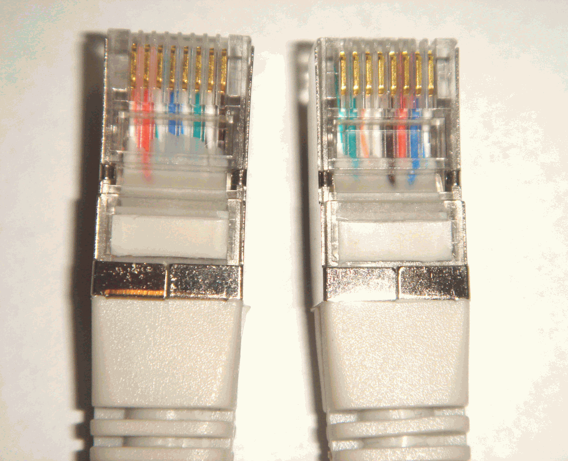
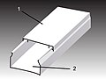
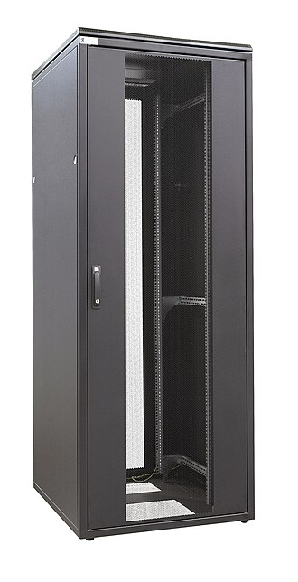
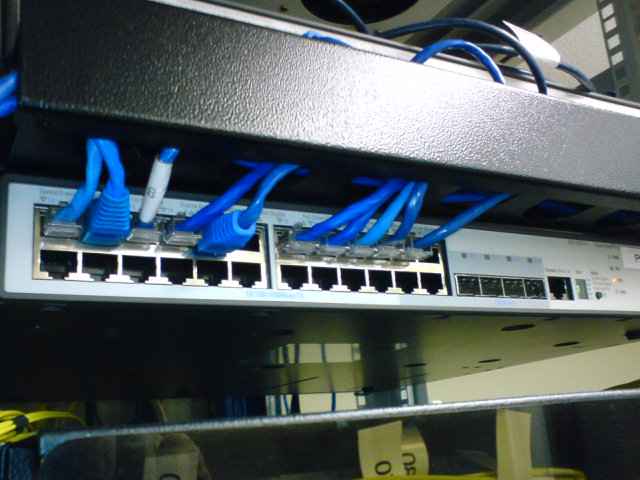
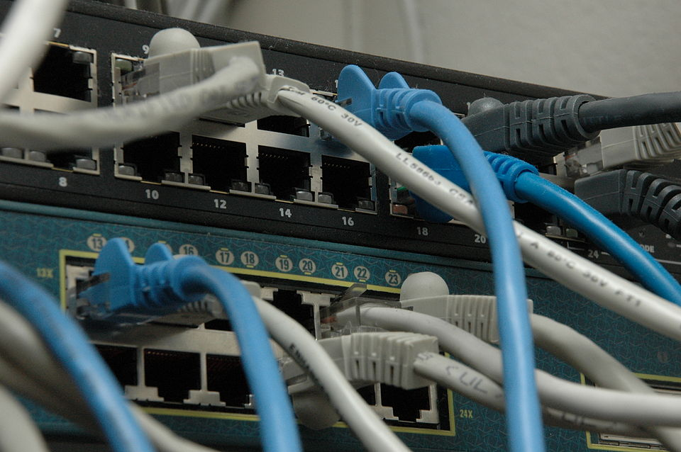
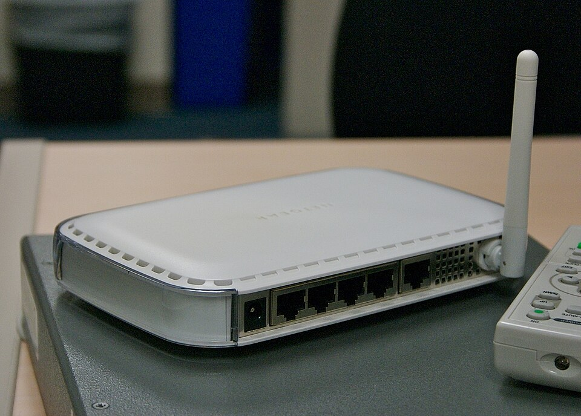

# Infraestrutura de Cabeamento de Rede

## Infraestrutura de Rede

Uma infraestrutura de rede é a composição estrutural e tecnológica que faz um sistema de rede funcionar. Uma infraestrutura de rede é a junção de todos os hardwares, softwares e meios físicos que fazem com que uma rede funcione, essa estrutura permite a conexão de dispositivos e a troca de dados entre hardwares. A infraestrutura de rede possuí etapas e níveis de complexidade podendo ir de um simples laboratório até um datacenter gigante.

Exemplo de Infraestrutura: 
 
A imagem utilizada de exemplo foi resgatada da [Wikipédia](https://wikipedia.org) mostra o [Laboratório de aula do Instituto Infnet](https://pt.wikipedia.org/wiki/Ficheiro:Laboratorio_aula_Infnet.jpg) - Faculdade de Engenharia de Software, Engenharia da Computação, Engenharia de Dados e IA | MBA e Pós em TI .

O exemplo acima nos ajuda a entender oque é uma estrutura de rede com relação ao nosso cotidiano. Nesse exemplo em especifico a estrutura de rede abordada é um laboratorio comum, esse laboratório para manter o seu funcionamento depende de uma estrutura de rede, essa estrutura é todos os componentes que estão presentes nessa imagem (Rack de rede, Patch Panel, Tomadas, Cabos, Switchs, Calhas, Roteador...) dentre esses componentes cada um cabe a dependencia da natureza da estrutura. Em resumo, a estrutura de rede é tudo aquilo que compoem um sistema que permite a conexão e a troca de dados de um dispositivo ao outro, independente de ser hardware, software ou equipamento.

## Estrutura de Cabeamento

A estrutura de cabeamento é tudo aquilo que compõe a etapa de montagem de uma estrutura de rede. Uma estrutura de rede requer uma preparação e equipamentos para além de computadores e outros dispositivos, esses equipamentos são oque vão possibilitar com que os dispositivos se comunique, dentre os termos usados para essa estrutura que compoẽ a infraestrutura de rede utilizamos o termo estrutura de cabeamento para definir as conexões de hardware que a infraestrutura irá receber de acordo com sua necessidade. Os equipamentos utilizados principalmente por essa estrutura é os cabos, porém a mais equipamentos nessa compossição cujo serão citados agora em conjunto ao exemplo:

Exemplo de cabeamento: 
 
A imagem utilizada pertence a publicação da [Wikipédia](https://wikipedia.org) [Exemplo de Cabeamento Estruturado](https://pt.wikipedia.org/wiki/Cabeamento_estruturado).

O exemplo acima mostra básicamente uma estrutura simples de cabeamento de rede voltado a empresas/companias, apesar de não ser o foco, também é um ótimo exemplo para entendermos como funciona o cabeamento de uma infraestrutura de rede. Dito isso vamos aos materiais e estruturas utilizadas (logicamente e visualmente) no exemplo:

- `Áreas de Trabalho`: As áreas de trabalho são os locais onde o objetivo da estrutura de cabeamento é conectar os cabos de rede aos dispositivos presentes. Em resumo a área de trabalho é onde ficariam os dispositivos e equipamentos do "consumidor final".

- `Sala de equipamentos`: A sala de equipamentos é o local onde ficaria o rack principal com modem, rotador, switch e patch panel. A sala principal é o local muito importante, ele básicamente conecta tudo, é onde as coisas que estão na área de trabalho vão ganhar vida.

- `Cabo de rede`: Os cabos de rede são os responsáveis pelas conexões entre computadores e `Switch`. Os cabos de rede são apresentados na imagem de exemplo como azul e vermelho, comumente inicialmente são os cabos rj45, porém a vários modelos de cabos de rede ou tecnicamente chamados de cabo CAT.

    - `Conectores RJ45 Macho`: Os conectores são básicamente o acabamento dos cabos de rede, o exemplo citado acima é a cabeça dos fios de rede.

    Exemplo:   

- `Canaletas/Calhas`: As canaletas ou Calhas são responsáveis por comportar de forma organizada os cabos de rede. As canaletas ou calhas tem o serviço de levar de forma organizadas os cabos de rede aos seus respectivos locais, servindo de passagem para os cabos até suas conexões.

    Exemplo:   

- `Tomadas de Superfície`: As tomadas de superfície são equipamentos utilizados para cabos CAT cpm objetivo de desviar o fluxo utilizando dois cabos. A tomada possibilita a troca de cabos de maneira mais simples, assim não depende do cabo que esta dentro da canaleta mais sim fora, por causa da tomada que desvia o fluxo.

- `Rack de Rede`: O Rack de Rede é o equipamento em formato de caixa responsável por conectar tudo. O Rack é a caixa que comporta na maioria das vezes o modem, roteador, switch e o patch panel, essas quatro coisas compoẽ a caixa que da a internet através do modem e roteador aos cabos de rede. Vale observar que s racks são utilizados secundáriamente também.

    Exemplo:   

- `Switch`: O Switch é o equipamento responsável por agrupar varios cabos e conectalos ao roteador. Os Switch são caixas cheias de conectores para os cabos de rede, eles se encontram dentro dos `Racks de rede`, esses cabos conectam no switch e o switch se conecta ao roteador. Os tamanhos dos Switch também variam, tendo diversas entradas.

    Exemplo:   

- `Patch Panel`: Os Patch Panel são chapas de metais com furos de formatos de conctores. Os Patch Panel se encontram no Rack e servem para organizar os fios dentro do rack de forma simples, eles geralmente vão de 24 até 48.
 
    Exemplo:   

- `Modem`: O Modem é o responsável pela distribuição de conexão externa a internet. O modem se encontra dentro do rack de rede, ele é responsavel por trazer a internet ao roteador.

    Exemplo:   

- `Roteador`: O Roteador é o dispositivo responsável por trazer a distribuição de internet para os dipositivos. O roteardor se encontra dentro do rack de rede conectado ao modem para trazer a internet aos dispositivos.

Resumindo todos esses equipamentos são a base de uma estrutura de rede simples/media. Os equipamentos citados compõe grande parte de uma estrutura de cabeamento de rede tendo em vista que o foco inicial é a construção do conceito de como funciona uma estrutura de cabeamento de rede.