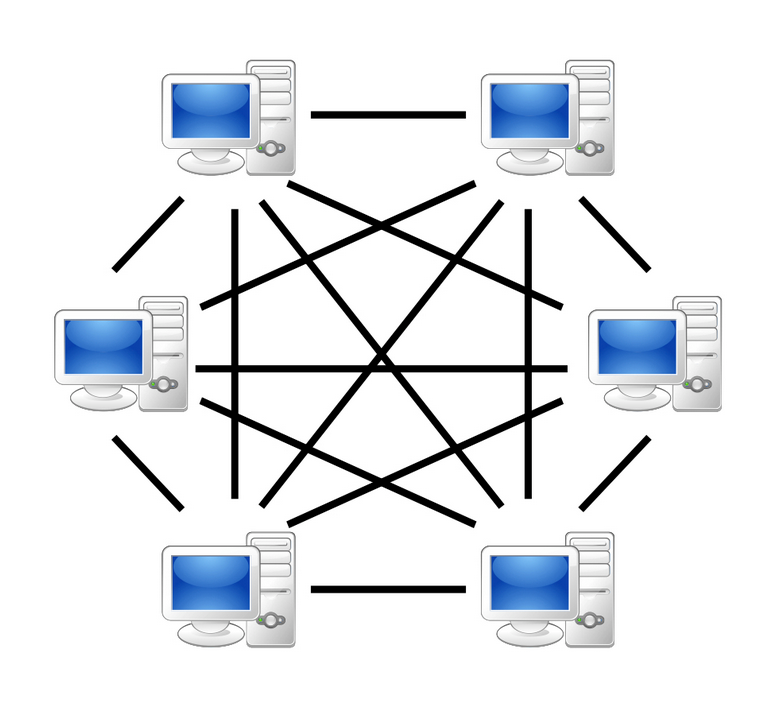
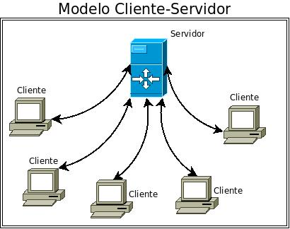

# P2P e Cliente-Servidor

## Tipos de Rede

Quando falamos de redes devemos entender que a diversos tipos. As redes não são coisas unicas por tanto tem tipos e dois deles são os mais conhecidos, Ponto a Ponto (P2P) e Client-Server (Cliente-Servidor), dependendo do tipo da sua rede ela se comporta de forma diferente, P2P e Client-Server não são os unicos tipos de rede possuem mais porém para um bom começo iremos entender sobre essas duas que são as "Principais". Agora que entendemos oque são tipos de redes e que se comportam diferente, vamos nos aprofundar nesses dois tipos.

## Ponto a Ponto (P2P)

A rede Ponto a Ponto (P2P) possui suas diferenças. A caracteristica principal de uma rede P2P é que ela não possui servidor, um bom exemplo é a rede que possuimos em casa uma rede doméstica que não possui servidor, ou seja a rede não tem um adiministrador controlando tudo, qualquer computador da rede pode ir lá e mudar as configurações. A rede P2P é uma rede sem adiministrador.

Ilustração de uma rede ponto a ponto (P2P): 
 

## Client-Server (Cliente-Servidor)

A rede Client-Server é uma rede mais administrativa. A rede Client-Server é uma rede com um servidor, ou seja á um administrador que configura tudo para os "Clientes", por exemplo redes de empresas, funcionam assim nem todos podem alterar as configurações de redes, caso o servidor principal de algum problemas os "Clientes" também seram afetados. A rede Client-Server é uma rede com adiministrador controlando as configurações.

Ilustração de uma rede Cliente-Servidor (Client-Server): 
 